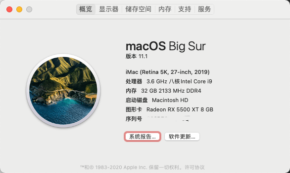
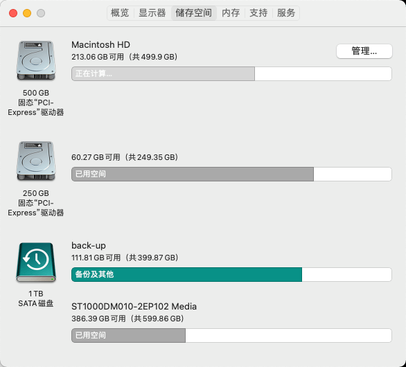
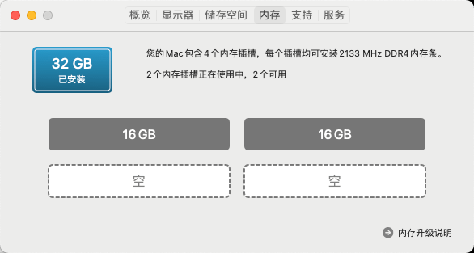
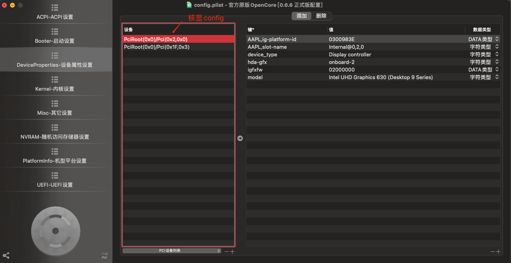

# hackintosh-opencore-gigabyte-z390-pro-wifi


```
macOS Big Sur
版本 11.1
iMac (Retina 5K, 27-inch, 2019)
处理器 3.6 GHz 八核Intel Core i9
内存 32 GB 2133 MHz DDR4
启动盘 Macintosh HD
图像卡 Radeon RX 5500 XT 8 GB
```

## Hardware
|        Type       	|              Item             	|   	|
|:-----------------:	|:-----------------------------:	|---	|
|        CPU        	| Intel - Core i9-9900k         	|   	|
|     CPU Cooler    	| Deepcool Castle 240 rgb       	|   	|
|    Motherboard    	| gigabyte-z390-aorus-pro-wifi  	|   	|
|     Video Card    	| Radeon RX 5500 XT 8 GB        	|   	|
|       Memory      	| USCORSAIR DDR4 3200 x 2       	|   	|
| Storage (macOS)   	| Samsung SSD 500GB 970 EVO M.2 	|   	|
| Storage (Windows) 	| Western SN750 250G            	|   	|
|  WiFi + Bluetooth 	| BCM94360CD                    	|   	|
|    Power Supply   	| USCORSAIR RM650X              	|   	|
|        Case       	| Jonsbo UMX4                   	|   	|


### Tools
1. OpenCore v0.6.6
2. OpenCore Configurator v2.28.0.0
3. MaciASL v1.5.9
4. Hackintool v3.5.3(0353)


### Question
#### fix macOS Big Sur Parallels Desktop15 run error
```shell
$ SYSTEM_VERSION_COMPAT=1 open -a "Parallels Desktop"
```

### MV
1. https://www.bilibili.com/video/BV1gi4y1x7qn?from=search&seid=7551406859784762848
2. https://www.bilibili.com/read/cv4288590/
3. https://blog.zuiyu1818.cn/posts/z390_NVRAM.html

### config



#### graphics_config


